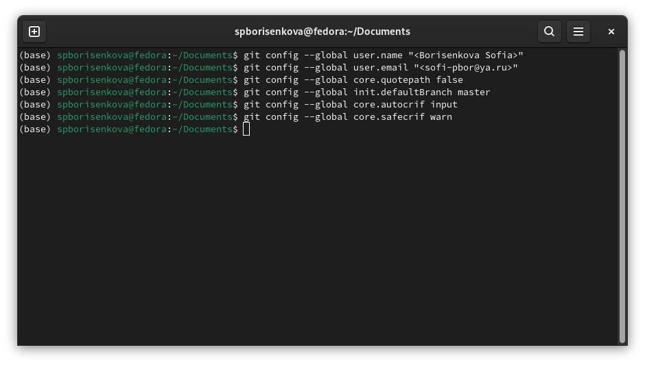
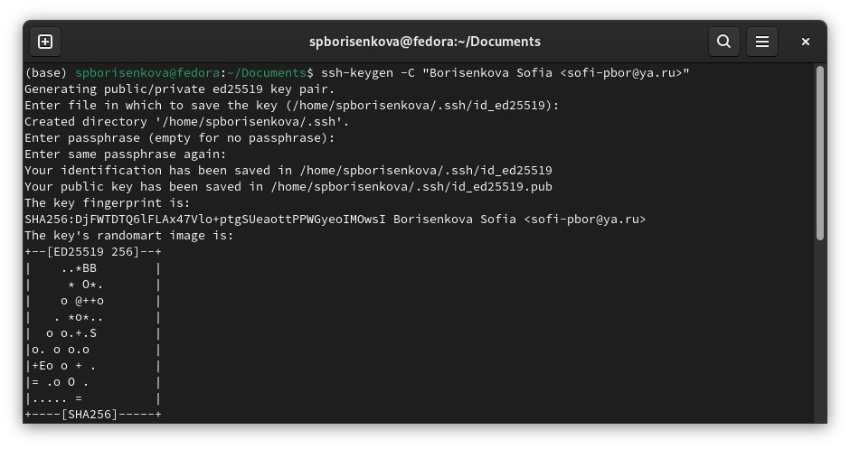
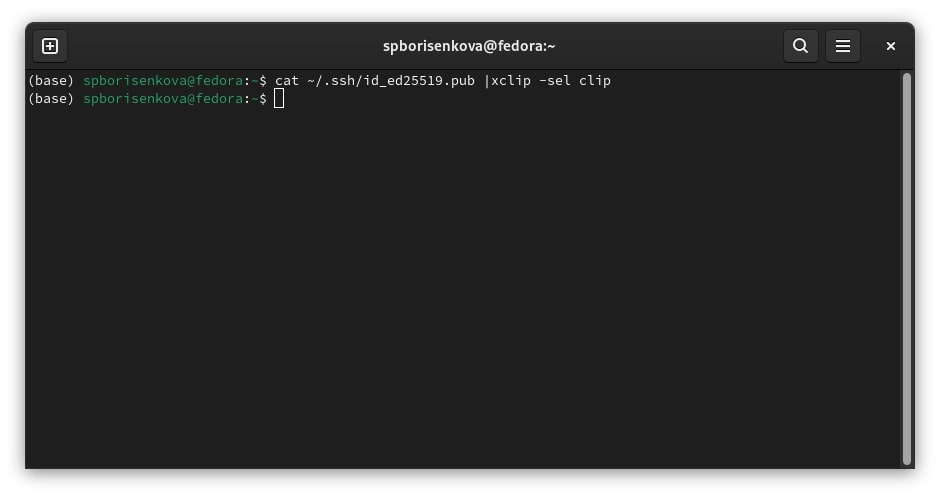
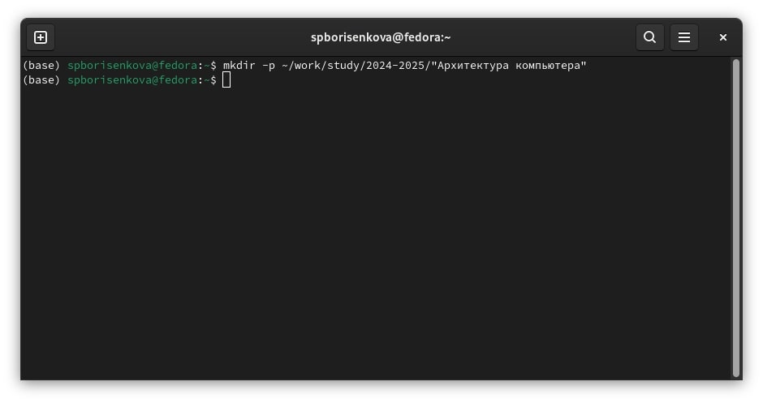
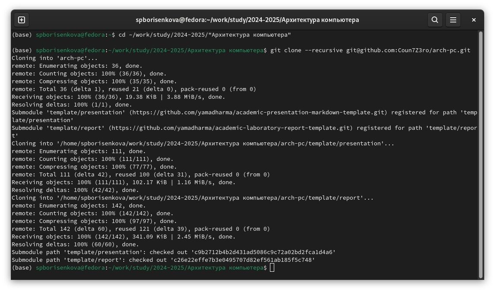
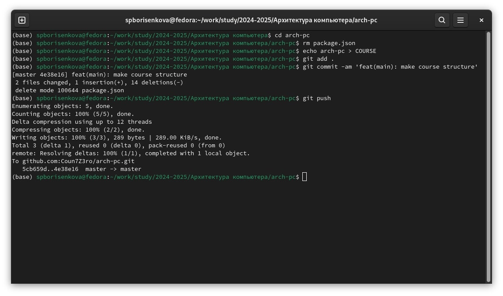

---
## Front matter
title: "Лабораторная работа №2"
subtitle: "Система контроля версий Git"
author: "Борисенкова София Павловна"

## Generic otions
lang: ru-RU
toc-title: "Содержание"

## Bibliography
bibliography: bib/cite.bib
csl: pandoc/csl/gost-r-7-0-5-2008-numeric.csl

## Pdf output format
toc: true # Table of contents
toc-depth: 2
lof: true # List of figures
lot: true # List of tables
fontsize: 12pt
linestretch: 1.5
papersize: a4
documentclass: scrreprt
## I18n polyglossia
polyglossia-lang:
  name: russian
  options:
	- spelling=modern
	- babelshorthands=true
polyglossia-otherlangs:
  name: english
## I18n babel
babel-lang: russian
babel-otherlangs: english
## Fonts
mainfont: IBM Plex Serif
romanfont: IBM Plex Serif
sansfont: IBM Plex Sans
monofont: IBM Plex Mono
mathfont: STIX Two Math
mainfontoptions: Ligatures=Common,Ligatures=TeX,Scale=0.94
romanfontoptions: Ligatures=Common,Ligatures=TeX,Scale=0.94
sansfontoptions: Ligatures=Common,Ligatures=TeX,Scale=MatchLowercase,Scale=0.94
monofontoptions: Scale=MatchLowercase,Scale=0.94,FakeStretch=0.9
mathfontoptions:
## Biblatex
biblatex: true
biblio-style: "gost-numeric"
biblatexoptions:
  - parentracker=true
  - backend=biber
  - hyperref=auto
  - language=auto
  - autolang=other*
  - citestyle=gost-numeric
## Pandoc-crossref LaTeX customization
figureTitle: "Рис."
tableTitle: "Таблица"
listingTitle: "Листинг"
lofTitle: "Список иллюстраций"
lotTitle: "Список таблиц"
lolTitle: "Листинги"
## Misc options
indent: true
header-includes:
  - \usepackage{indentfirst}
  - \usepackage{float} # keep figures where there are in the text
  - \floatplacement{figure}{H} # keep figures where there are in the text
---

# Цель работы

Целью работы является изучить идеологию и применение средств контроля версий. Приобрести практические навыки по работе с системой git.

# Выполнение лабораторной работы

Сначала сделаем предварительную конфигурацию git. Откроем терминал и введём следующие команды, указав имя и email владельца репозитория и другие параметры. (рис. 1) 

Для того, чтобы сервер мог идентифицировать пользователя, необходимо сгенерировать ssh ключи. Для этого мы введем следующую команду. (рис. 2) 

Затем скопируем следующей командой ключ в буфер обмена и вставляем его в соответствующее поле на github. (рис. 3)

Откроем терминал и создадим каталог для предмета «Архитектура компьютера». (рис. 4) 

Создадим репозиторий. Будем создавать его на основе шаблона, который находится по следующему адресу: 
https://github.com/yamadharma/course-directory-student-template Нажимаем на кнопку "Use this template", и в предложенных опциях выбираем "Create new repository". Задаём имя репозитория. Он будет называться arсh-pc. Далее нам нужно клонировать репозиторий на наш компьютер. Для этого перейдем в папку "Архитектура компьютера" и клонируем репозиторий. (рис. 5)

Теперь перейдем к настройке клонированного каталога. Для начала перейдем в него с помощью команды "cd", удалим лишний файл с помощью команды "rm" и создадим необходимые каталоги. 
Теперь нам остается отправить файлы на сервер. Для этого с помощью команды git add мы добавим каталоги, которые должны отправляться на сервер. Теперь с помощью команды git commit мы сохраним изменения и укажем комментарий, в котором будет поясняться, какие изменения мы сделали. В данном случае в комментарии мы напишем, что создали структуру курса. Теперь нам осталось окончательно загрузить изменения на сервер. Для этого мы воспользуемся командой git push. (рис. 6) 

# Задание для самостоятельной работы

Теперь приступим к выполнению самостоятельной работы. 
Для начала мы создадим файл отчета для нашей лабораторной работы в папке labs/lab02/report.
После этого скопируем отчет по нашей предыдущей лабораторной работе в соответствующую папку созданного нами рабочего пространства, то есть в папку labs/lab01/report.
Теперь нам осталось лишь загрузить изменения на GitHub. Воспользуемся командой "git add ." для того, чтобы указать, что мы хотим сохранить изменения во всех файлах, находящихся в нашем каталоге. После этого с помощью команды "git commit" мы укажем комментарий и сохраним изменения. (рис. 31) 
После этого введём команду "git push" для того, чтобы загрузить файлы на GitHub 

# Выводы

В результате выполнения лабораторной работы появились практические навыки работы с системой контроля версий Git, была произведена её первоначальная настройка в linux.
Было изучено, как создавать репозитории, сохранять изменения и добавлять к ним комментарии, а также как выгружать файлы на сервер. Были приобретены навыки работы с платформой GitHub.

