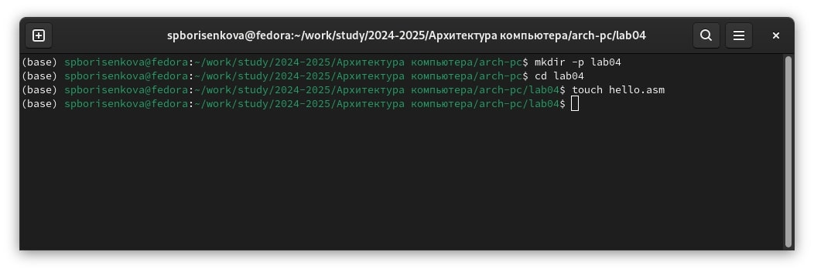
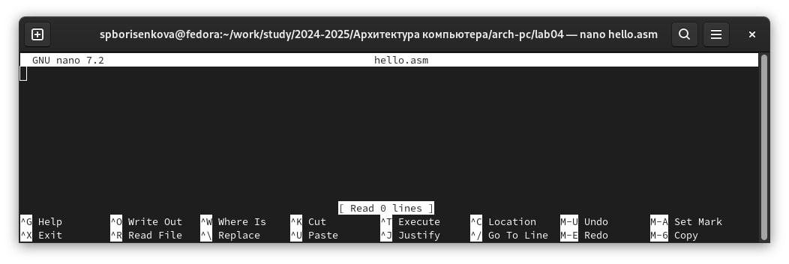
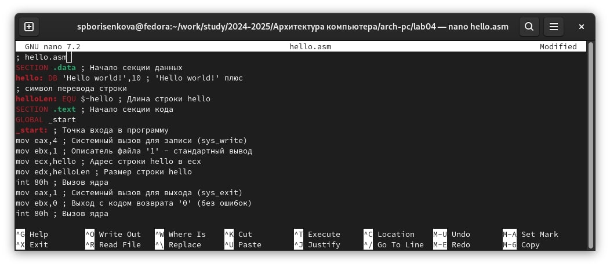
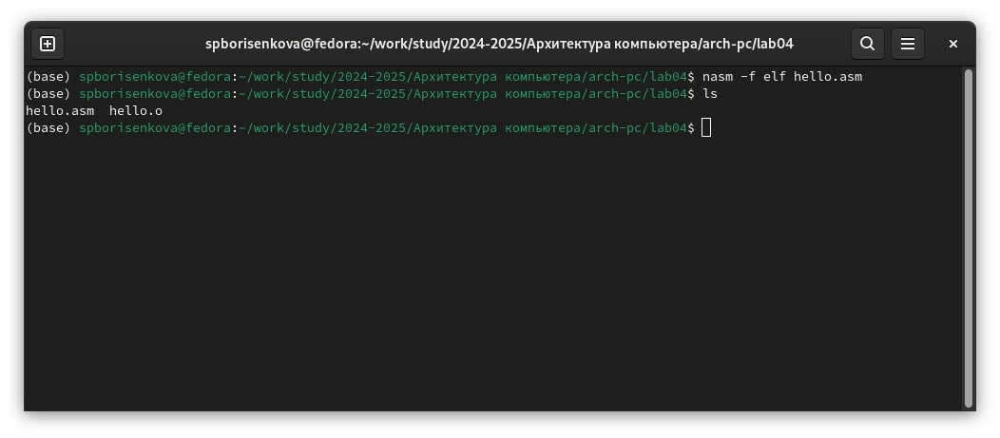
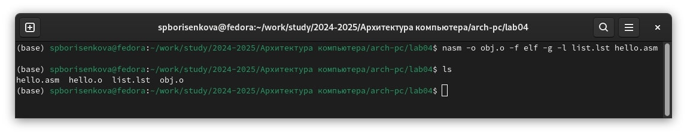
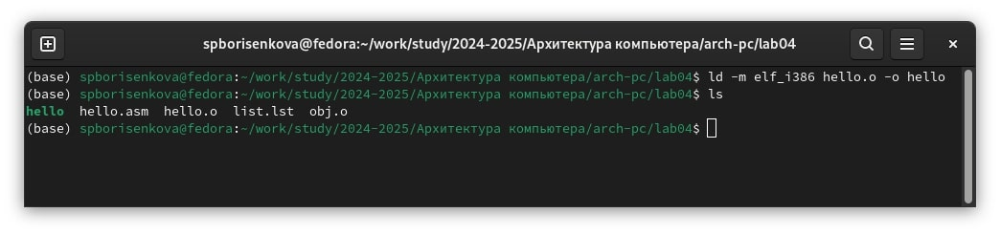
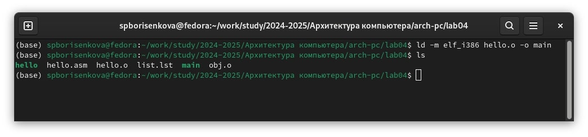
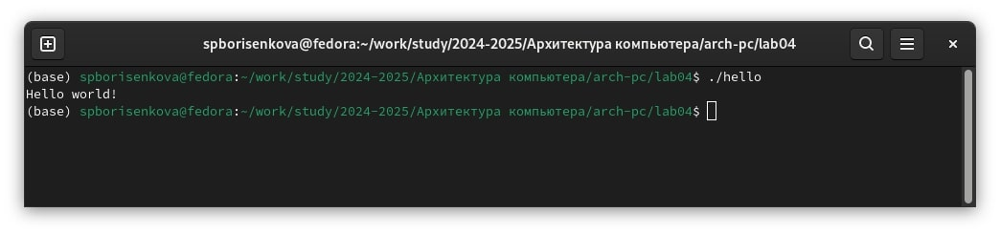
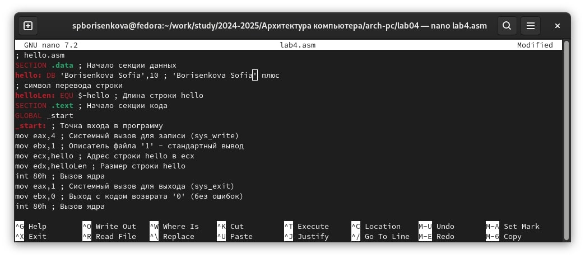
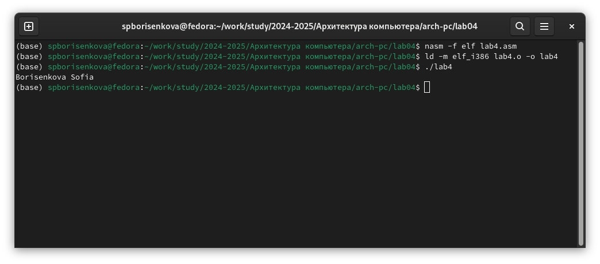

---
## Front matter
title: "Лабораторная работа №4"
subtitle: "Создание и процесс обработки программ на языке ассемблера NASM"
author: "Борисенкова София Павловна"

## Generic otions
lang: ru-RU
toc-title: "Содержание"

## Bibliography
bibliography: bib/cite.bib
csl: pandoc/csl/gost-r-7-0-5-2008-numeric.csl

## Pdf output format
toc: true # Table of contents
toc-depth: 2
lof: true # List of figures
lot: true # List of tables
fontsize: 12pt
linestretch: 1.5
papersize: a4
documentclass: scrreprt
## I18n polyglossia
polyglossia-lang:
  name: russian
  options:
	- spelling=modern
	- babelshorthands=true
polyglossia-otherlangs:
  name: english
## I18n babel
babel-lang: russian
babel-otherlangs: english
## Fonts
mainfont: IBM Plex Serif
romanfont: IBM Plex Serif
sansfont: IBM Plex Sans
monofont: IBM Plex Mono
mathfont: STIX Two Math
mainfontoptions: Ligatures=Common,Ligatures=TeX,Scale=0.94
romanfontoptions: Ligatures=Common,Ligatures=TeX,Scale=0.94
sansfontoptions: Ligatures=Common,Ligatures=TeX,Scale=MatchLowercase,Scale=0.94
monofontoptions: Scale=MatchLowercase,Scale=0.94,FakeStretch=0.9
mathfontoptions:
## Biblatex
biblatex: true
biblio-style: "gost-numeric"
biblatexoptions:
  - parentracker=true
  - backend=biber
  - hyperref=auto
  - language=auto
  - autolang=other*
  - citestyle=gost-numeric
## Pandoc-crossref LaTeX customization
figureTitle: "Рис."
tableTitle: "Таблица"
listingTitle: "Листинг"
lofTitle: "Список иллюстраций"
lotTitle: "Список таблиц"
lolTitle: "Листинги"
## Misc options
indent: true
header-includes:
  - \usepackage{indentfirst}
  - \usepackage{float} # keep figures where there are in the text
  - \floatplacement{figure}{H} # keep figures where there are in the text
---

# Цель работы

Освоение процедуры компиляции и сборки программ, написанных на ассемблере NASM

# Выполнение лабораторной работы

Создадим нужную директорию с помощью команды mkdir. Переместимся в созданный нами каталог и создадим файл hello с расширением .asm, в котором мы будем писать код на ассемблере (Рис. 2.1):

Для того, чтобы редактировать созданный файл, воспользуемся текстовым редактором nano (Рис. 2.2):

Вставим в открытый файл код из описания лабораторной работы (Рис. 2.3):

Теперь нам необходимо превратить наш файл в объектный. Этим занимается транслятор NASM. Введём следующую команду и проверим, создался ли объектный файл с помощью команды ls (Рис. 2.4):

Теперь попробуем использовать полный вариант команды NASM и проверим, создался ли файл с помощью команды ls (Рис. 2.5):

Для создания исполняемого файла необходимо использовать компоновщик ld, который соберёт объектный файл. Введем следующую команду и проверим, создался ли файл с помощью команды ls (Рис. 2.6):

Теперь соберём файл obj.o в файл main и проверим, создался ли файл. (Рис. 2.7):

Теперь запустим файл hello.(Рис. 2.8):

# Выполнение задания для самостоятельной работы

Скопируем файл hello.asm в каталог ~/work/arch-pc/lab04 под названием lab4.asm и внесём изменения в скопированный файл. Изменим третью строчку, заменив фразу Hello world! на фамилию и имя (Рис. 3.1):

Теперь скомпилируем полученный файл в объектный, соберём полученный объектный файл. Укажем, что выходной файл должен быть назван lab4 и запустим собранный файл (Рис. 3.2):

Теперь скопируем файлы hello.asm, lab4.asm в каталог 4 лабораторной работы и загрузим результат проделанной лабораторной работы на GitHub.

# Выводы

В результате выполнения лабораторной работы появилось понимание того, как работает алгоритм создания исполняемого файла из кода на ассемблере, а также появились навыки работы с языком nasm, компиляции кода в объектный файл и сборкой исполняемых программ.

