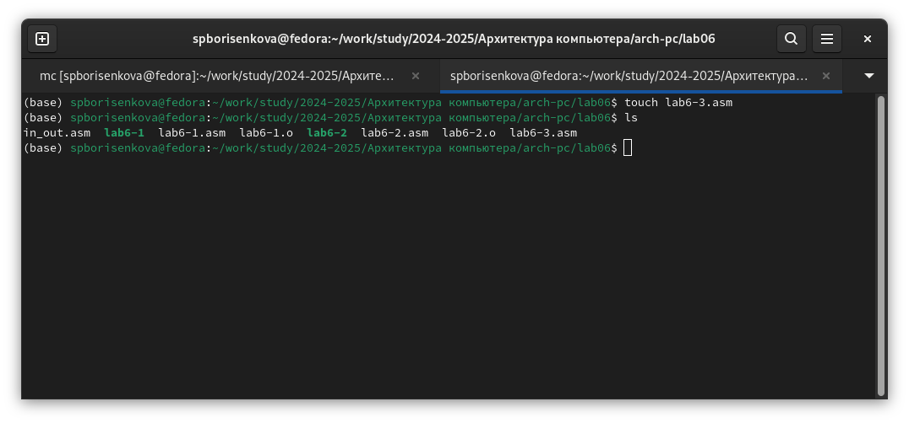

---
## Front matter
title: "Лабораторная работа №6"
subtitle: "Арифметические операции в NASM"
author: "Борисенкова София Павловна"

## Generic otions
lang: ru-RU
toc-title: "Содержание"

## Bibliography
bibliography: bib/cite.bib
csl: pandoc/csl/gost-r-7-0-5-2008-numeric.csl

## Pdf output format
toc: true # Table of contents
toc-depth: 2
lof: true # List of figures
lot: true # List of tables
fontsize: 12pt
linestretch: 1.5
papersize: a4
documentclass: scrreprt
## I18n polyglossia
polyglossia-lang:
  name: russian
  options:
	- spelling=modern
	- babelshorthands=true
polyglossia-otherlangs:
  name: english
## I18n babel
babel-lang: russian
babel-otherlangs: english
## Fonts
mainfont: IBM Plex Serif
romanfont: IBM Plex Serif
sansfont: IBM Plex Sans
monofont: IBM Plex Mono
mathfont: STIX Two Math
mainfontoptions: Ligatures=Common,Ligatures=TeX,Scale=0.94
romanfontoptions: Ligatures=Common,Ligatures=TeX,Scale=0.94
sansfontoptions: Ligatures=Common,Ligatures=TeX,Scale=MatchLowercase,Scale=0.94
monofontoptions: Scale=MatchLowercase,Scale=0.94,FakeStretch=0.9
mathfontoptions:
## Biblatex
biblatex: true
biblio-style: "gost-numeric"
biblatexoptions:
  - parentracker=true
  - backend=biber
  - hyperref=auto
  - language=auto
  - autolang=other*
  - citestyle=gost-numeric
## Pandoc-crossref LaTeX customization
figureTitle: "Рис."
tableTitle: "Таблица"
listingTitle: "Листинг"
lofTitle: "Список иллюстраций"
lotTitle: "Список таблиц"
lolTitle: "Листинги"
## Misc options
indent: true
header-includes:
  - \usepackage{indentfirst}
  - \usepackage{float} # keep figures where there are in the text
  - \floatplacement{figure}{H} # keep figures where there are in the text
---

# Цель работы

Познакомиться с базовыми инструкциями языка Ассемблер, отвечающими за основные арифметические операции

# Выполнение лабораторной работы

Для начала выполнения лабораторной работы необходимо создать папку рабочего каталога и файл lab6-1.asm (Рис. 2.1):

Вставим в наш созданный файл код из листинга 6.1 (Рис. 2.2):

Перед сборкой файла стоит учесть, что он использует сторонний файл in_out.asm. Cкопируем его из каталога пятой лабораторной работы (Рис. 2.3):

Теперь соберём наш файл в исполняемое приложение. Запустим его и посмотрим на результат (Рис. 2.4):

Программа выводит символ j, однако это неправильный вывод. Наша цель - сложить 6 и 4, и получить в выводе число 10. Изменим файл (Рис. 2.5):

Мы убрали кавычки у цифр, и теперь складываем уже не символы 6 и 4, а числа. Теперь попробуем собрать исполняемый исполняемый файл также и запустим его (Рис. 2.6): 

Мы видим, что ничего не вывелось. Но так ли это? Когда мы вызываем команду sprintLF, она выводит не число 10, а символ с номером 10. Посмотрим на таблицу ASCII и увидим, что символ под номером 10 это символ перевода строки. Именно поэтому мы его не видим, мы видим просто новую строку. Теперь создадим второй файл под названием lab6-2.asm (Рис. 2.7):

Вставим в него код из листинга 6.2 (Рис. 2.8):

Основное отличие заключается в том, что вместо sprintLF используется iprintLF. Соберём файл и запустим его, чтобы посмотреть, как изменится вывод (Рис. 2.9):

Мы видим число 106. Так как цифры в коде указаны в кавычках, мы складываем их коды (54 и 52 в сумме дают 106). Теперь программа способна вывести число, а не символ ASCII с соответствующим номером. Теперь, если мы уберём кавычки у цифр, программа должна вывести 10. Убедимся в этом, сделав соответствующие изменения в коде (Рис. 2.10):

Соберём программу и запустим её (Рис. 2.11): 

Как видим, программа действительно вывела число 10. Кроме операции iprintLF в файле in_out.asm есть операция iprint. Посмотрим, чем они отличаются. Заменим в коде iprintLF на iprint (Рис. 2.12):

Попробуем собрать программу и запустить её (Рис. 2.13):

Как видим, операция iprint не переносит на следующую строку, в отличие от iprintLF.
Теперь создадим третий файл (Рис. 2.14):

Он должен выводить значение функции (5*2+3)/3. Для этого вставим код из файла листинга 6.3 (Рис. 2.15):

Попробуем запустить эту программу (Рис. 2.16):

Полученный результат совпадает с результатом, указанным в лабораторной работе. Теперь изменим файл так, чтобы он вычислял значение выражения (4*6+2)/5. Для этого поменяем числа в коде следующим образом(Рис. 2.17):

Соберём программу и запустим её (Рис. 2.18):

Вывод корректный. Теперь создадим файл variant.asm для вычисления варианта самостоятельной работы (Рис. 2.19):

Вставим в файл код из листинга 6.4 (Рис. 2.20):

Соберём и запустим программу, указав номер студенческого билета. В моём случае это 1132246834 (Рис. 2.21):

Мой вариант - 15.

 Ответы на вопросы:

 1. За это отвечает 25-ая строчка call sprint, перед которой идёт строка mov eax,rem, которая перемещает строку с фразой в регистр eax, из которого мы считываем данные для вывода

 2. Эти строки используются для того, чтобы записать данные в переменную x

 3. Для преобразования ASCII кода в число

 4. Напрямую за вычисление отвечают следующие строки:

 div ebx

 inc edx

 5. В регистр edx

 6. Для увеличения значения регистра edx на единицу

 7. За это отвечают строки:

 mov eax,edx

 call iprintLF

# Выполнение задания для самостоятельной работы

Теперь в качестве самостоятельной работы напишем код программы для вычисления выражения в варианте 15: (5+x)^2-3 . В предварительно созданном файле Task15.asm напишем следующий код (Рис. 3.1):

И запустим его, указав в качестве x предложенные в лабораторной работе значения (Рис. 3.2):

# Выводы

В результате выполнения лабораторной работы было получено представление о том, какие арифметические операции есть в языке ассемблера, и как они работают. Были написаны программы, использующие в себе операции сложения, вычитания, умножения и деления.
