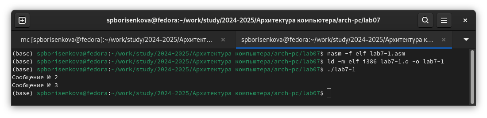
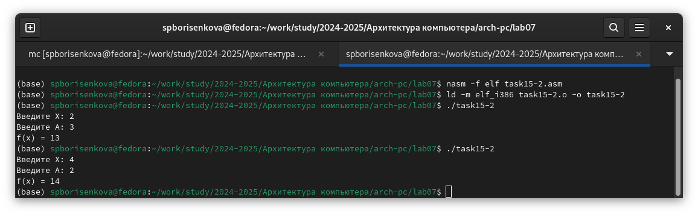

---
## Front matter
title: "Лабораторная работа №7"
subtitle: "Команды безусловного и условного переходов в Nasm. Программирование ветвлений"
author: "Борисенкова София Павловна"

## Generic otions
lang: ru-RU
toc-title: "Содержание"

## Bibliography
bibliography: bib/cite.bib
csl: pandoc/csl/gost-r-7-0-5-2008-numeric.csl

## Pdf output format
toc: true # Table of contents
toc-depth: 2
lof: true # List of figures
lot: true # List of tables
fontsize: 12pt
linestretch: 1.5
papersize: a4
documentclass: scrreprt
## I18n polyglossia
polyglossia-lang:
  name: russian
  options:
	- spelling=modern
	- babelshorthands=true
polyglossia-otherlangs:
  name: english
## I18n babel
babel-lang: russian
babel-otherlangs: english
## Fonts
mainfont: IBM Plex Serif
romanfont: IBM Plex Serif
sansfont: IBM Plex Sans
monofont: IBM Plex Mono
mathfont: STIX Two Math
mainfontoptions: Ligatures=Common,Ligatures=TeX,Scale=0.94
romanfontoptions: Ligatures=Common,Ligatures=TeX,Scale=0.94
sansfontoptions: Ligatures=Common,Ligatures=TeX,Scale=MatchLowercase,Scale=0.94
monofontoptions: Scale=MatchLowercase,Scale=0.94,FakeStretch=0.9
mathfontoptions:
## Biblatex
biblatex: true
biblio-style: "gost-numeric"
biblatexoptions:
  - parentracker=true
  - backend=biber
  - hyperref=auto
  - language=auto
  - autolang=other*
  - citestyle=gost-numeric
## Pandoc-crossref LaTeX customization
figureTitle: "Рис."
tableTitle: "Таблица"
listingTitle: "Листинг"
lofTitle: "Список иллюстраций"
lotTitle: "Список таблиц"
lolTitle: "Листинги"
## Misc options
indent: true
header-includes:
  - \usepackage{indentfirst}
  - \usepackage{float} # keep figures where there are in the text
  - \floatplacement{figure}{H} # keep figures where there are in the text
---

# Цель работы

Изучение команд условного и безусловного переходов. Приобретение навыков написания
программ с использованием переходов. Знакомство с назначением и структурой файла
листинга.

# Выполнение лабораторной работы

Для начала выполнения лабораторной работы необходимо создать рабочую папку lab07 и файл lab7-1.asm (рис. 2.1):

Вставим код в файл lab7-1.asm из файла листинга (рис. 2.2):

Теперь скопируем файл in_out.asm из рабочей директории прошлой лабораторной работы (рис. 2.3):

Теперь соберём программу из файла lab7-1.asm и запустим её (рис. 2.4):

Изменим файл lab7-1.asm согласно листингу 7.2 (рис. 2.5):

Снова соберём программу и запустим её (рис. 2.6):

Теперь сделаем так, чтобы код выводил сообщения в от третьего к первому. Для этого внесём в код следующие изменения (рис. 2.7):

И запустим её, предварительно собрав (рис. 2.8):

Теперь создадим файл lab7-2.asm (рис. 2.9):

Запишем код из листинга 7.3 в файл lab7-2.asm (рис. 2.10):

И запустим его, предварительно собрав (рис. 2.11):

Теперь попробуем создать файл листинга при сборке файла lab7-2.asm и посмотрим, как выглядит файл листинга изнутри. Для этого откроем его в mcedit (рис. 2.12):

Открыв его, мы видим следующее (рис. 2.13):

Разберём несколько строк файла листинга: 

 1. Строка под номером 21 перемещает содержимое B в регистр eax. Адрес указывается сразу после номера. Следом идёт машинный код, который представляет собой исходную ассемблированную строку в виде шестнадцатиричной системы. Далее идёт исходный код

 2. 22-ая строка отвечает за вызов функции atoi. Она также имеет адрес и машинный код

 3. Строка 23 отвечает за запись значения в регистре eax в B.

Теперь попробуем намеренно допустить ошибку в нашем коде, убрав у команды один из операндов (рис. 2.14):

И попробуем собрать файл с ошибкой, генерируя файл листинга (рис. 2.15):

Мы видим, что объектный файл не создался, однако появился файл листинга.
Теперь зайдём в файл листинга, и посмотрим, отображается ли в нём ошибка (рис. 2.16):

Как видим, в листинге прописана ошибка

# Выполнение задания для самостоятельной работы

Создадим файл для выполнения самостоятельной работы. Мой вариант - 15. Напишем код для выполнения задания. Код выглядит так (рис. 3.1):

Соберём, запустим его и посмотрим на результат (рис. 3.2):

Теперь создадим второй файл самостоятельной работы для второго задания. Код будет выглядеть так (рис. 3.3):

Соберём исполняемый файл и запустим его (рис. 3.8):

Как видим, программа выполнена успешно

# Выводы

В результате лабораторной работы были написаны программы, которые используют команды условных и безусловных переходов, были получены навыки работы с этими командами, а также были созданы и успешно прочитаны листинги для некоторых из программ.

