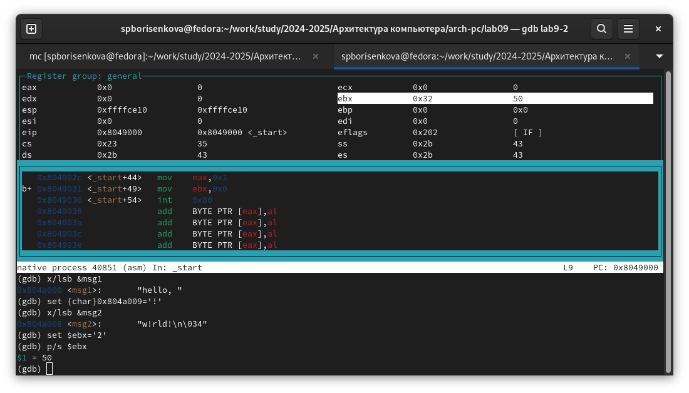
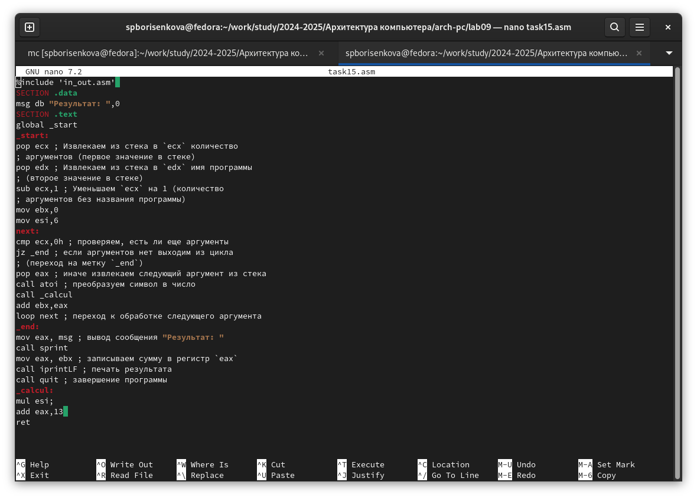

---
## Front matter
title: "Лабораторная работа №9"
subtitle: "Понятие подпрограммы. Отладчик GDB."
author: "Борисенкова София Павловна"

## Generic otions
lang: ru-RU
toc-title: "Содержание"

## Bibliography
bibliography: bib/cite.bib
csl: pandoc/csl/gost-r-7-0-5-2008-numeric.csl

## Pdf output format
toc: true # Table of contents
toc-depth: 2
lof: true # List of figures
lot: true # List of tables
fontsize: 12pt
linestretch: 1.5
papersize: a4
documentclass: scrreprt
## I18n polyglossia
polyglossia-lang:
  name: russian
  options:
	- spelling=modern
	- babelshorthands=true
polyglossia-otherlangs:
  name: english
## I18n babel
babel-lang: russian
babel-otherlangs: english
## Fonts
mainfont: IBM Plex Serif
romanfont: IBM Plex Serif
sansfont: IBM Plex Sans
monofont: IBM Plex Mono
mathfont: STIX Two Math
mainfontoptions: Ligatures=Common,Ligatures=TeX,Scale=0.94
romanfontoptions: Ligatures=Common,Ligatures=TeX,Scale=0.94
sansfontoptions: Ligatures=Common,Ligatures=TeX,Scale=MatchLowercase,Scale=0.94
monofontoptions: Scale=MatchLowercase,Scale=0.94,FakeStretch=0.9
mathfontoptions:
## Biblatex
biblatex: true
biblio-style: "gost-numeric"
biblatexoptions:
  - parentracker=true
  - backend=biber
  - hyperref=auto
  - language=auto
  - autolang=other*
  - citestyle=gost-numeric
## Pandoc-crossref LaTeX customization
figureTitle: "Рис."
tableTitle: "Таблица"
listingTitle: "Листинг"
lofTitle: "Список иллюстраций"
lotTitle: "Список таблиц"
lolTitle: "Листинги"
## Misc options
indent: true
header-includes:
  - \usepackage{indentfirst}
  - \usepackage{float} # keep figures where there are in the text
  - \floatplacement{figure}{H} # keep figures where there are in the text
---

# Цель работы

Приобретение навыков написания программ с использованием подпрограмм. Знакомство с методами отладки при помощи GDB и его основными возможностями

# Выполнение лабораторной работы

Для начала выполнения лабораторной работы создадим рабочую директорию и файл lab9-1.asm (рис. 2.1):

Теперь, вставим в ранее созданный файл из листинга 9.1. 

Чтобы собрать код, нужен файл in_out.asm. скопируем его из директории прошлой лабораторной работы (рис. 2.3):

Теперь соберём программу и посмотрим на результат выполнения. Она работает корректно. Изменим код, добавив подпрограмму subcalcul

Попробуем собрать программу и запустить её (рис. 2.5):

Как видим, она корректно выводит значение функции. Создадим второй файл и вставим в него код из файла листинга 9.2 (рис. 2.6):

Соберём его и откроем исполняемый файл в отладчике (рис. 2.7):

Запустим программу командой run (рис. 2.8):

Установим брейкпоинт и запустим ещё раз: (рис. 2.9):

Переключимся на отображение команд с синтаксисом intel (рис. 2.10):

Главные отличия синтаксиса AT&T и Intel состоят в порядке записи переменных в командах, виде записи числовых констант, и особенностях записиимён регистров. 
Включим режим псевдографики (рис. 2.11):

Проверим существующие точки останова командой info breakpoints (рис. 2.12):

Установим ещё одну по адресу инструкции и опять выведем список точек останова.(рис. 2.13):

Проверим содержание регистров. (рис. 2.14):

Проверим содержание переменной msg1 по имени. (рис. 2.15):

Проверим содержание переменной msg2 по адресу. (рис. 2.16):

Изменим командой set содержание msg1 и msg2. (рис. 2.17):

Изменим командой set содержание ebx. (рис. 2.18):

Скопируем файл lab8-2.asm в файл с именем lab9-3.asm и создадим исполняемый файл(рис. 2.19):

Загрузим файл в gdb и исследуем расположение аргументов командной строки в стеке после запуска программы (рис. 2.20):

Как видим, для вывода каждого элемента стека нам нужно менять значение адреса с шагом 4. Это связано с тем, что под каждый элемент выделяется 4 байта

# Выполнение задания для самостоятельной работы

Для выполнения самостоятельной работы создадим файл  task15.asm. Скопируем в него программу из работы 8 и изменим соответственно заданию(рис. 3.1):

Соберём и запустим программу, вводя различные аргументы (рис. 3.2):

Пересчитав результат вручную, убеждаемся, что программа работает верно

Создадим файл  list9-3.asm. Скопируем в него листинг и изменим соответственно заданию(рис. 3.3):

Соберём и запустим программу (рис. 3.4):

Пересчитав результат вручную, убеждаемся, что теперь программа работает верно
# Выводы

В результате выполнения лабораторной работы были получены представления о работе подпрограмм, а также было реализовано несколько программ, использующих подпрограммы. Также, были получены навыки работы с базовым функионалом gdb, и с помощью gdb была отловлена ошибка в коде программы

