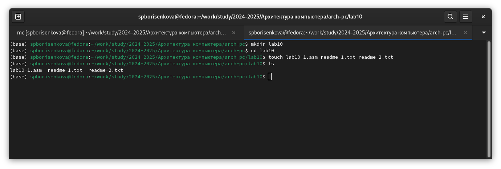
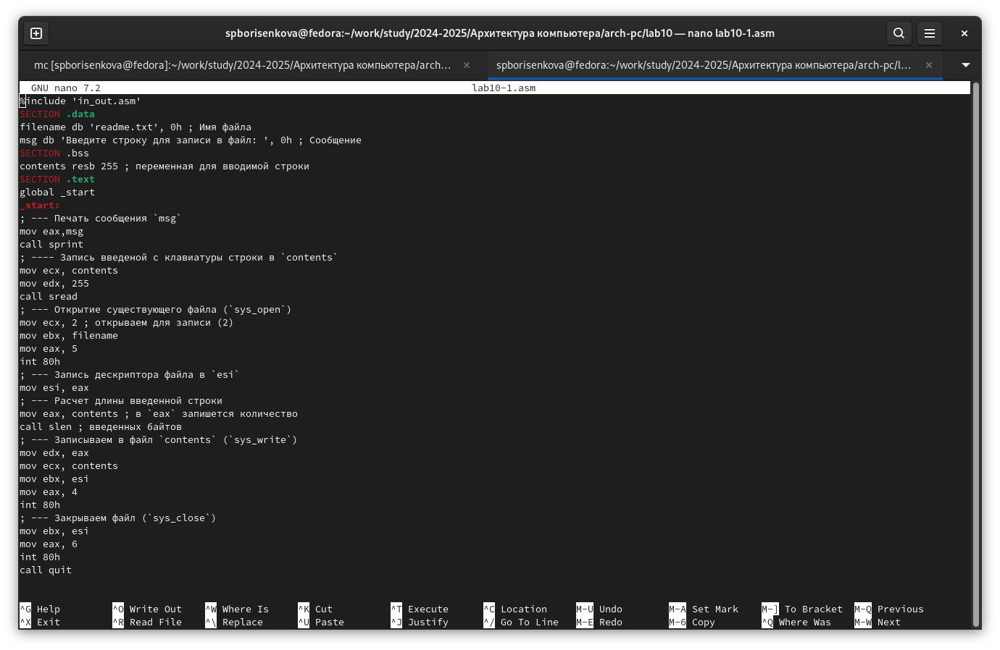
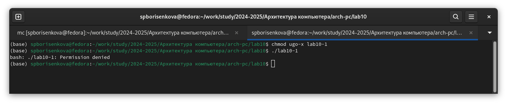
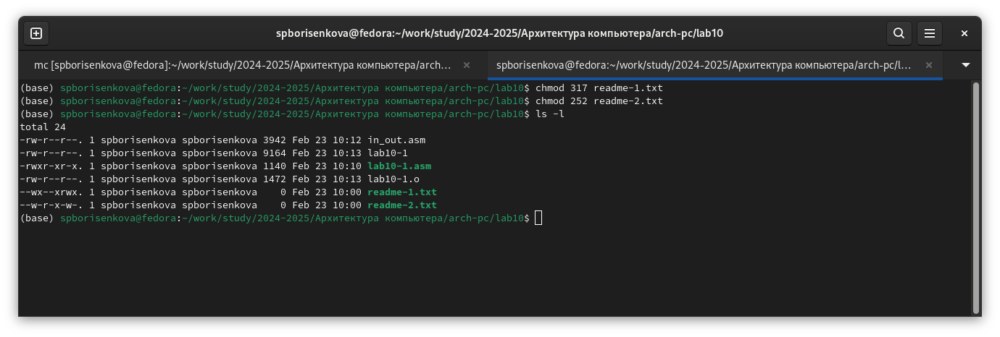

---
## Front matter
title: "Лабораторная работа №10"
subtitle: "Работа с файлами средствами Nasm"
author: "Борисенкова София Павловна"

## Generic otions
lang: ru-RU
toc-title: "Содержание"

## Bibliography
bibliography: bib/cite.bib
csl: pandoc/csl/gost-r-7-0-5-2008-numeric.csl

## Pdf output format
toc: true # Table of contents
toc-depth: 2
lof: true # List of figures
lot: true # List of tables
fontsize: 12pt
linestretch: 1.5
papersize: a4
documentclass: scrreprt
## I18n polyglossia
polyglossia-lang:
  name: russian
  options:
	- spelling=modern
	- babelshorthands=true
polyglossia-otherlangs:
  name: english
## I18n babel
babel-lang: russian
babel-otherlangs: english
## Fonts
mainfont: PT Serif
romanfont: PT Serif
sansfont: PT Sans
monofont: PT Mono
mainfontoptions: Ligatures=TeX
romanfontoptions: Ligatures=TeX
sansfontoptions: Ligatures=TeX,Scale=MatchLowercase
monofontoptions: Scale=MatchLowercase,Scale=0.9
## Biblatex
biblatex: true
biblio-style: "gost-numeric"
biblatexoptions:
  - parentracker=true
  - backend=biber
  - hyperref=auto
  - language=auto
  - autolang=other*
  - citestyle=gost-numeric
## Pandoc-crossref LaTeX customization
figureTitle: "Рис."
tableTitle: "Таблица"
listingTitle: "Листинг"
lofTitle: "Список иллюстраций"
lotTitle: "Список таблиц"
lolTitle: "Листинги"
## Misc options
indent: true
header-includes:
  - \usepackage{indentfirst}
  - \usepackage{float} # keep figures where there are in the text
  - \floatplacement{figure}{H} # keep figures where there are in the text
---

# Цель работы

Приобрести навыки работы с файлами в Ассемблере, а также разобраться с понятием прав доступа в linux

# Выполнение лабораторной работы

Для начала выполнения работы необходимо создать рабочую папку и файл lab10-1.asm, а также файлы readme-1.txt и readme-2.txt (Рис. 2.1):

Вставим в файл lab10-1.asm код из листинга 10.1 (Рис. 2.2):

Скопируем файл in_out.asm из директории прошлой работы (Рис. 2.3):

Соберём программу и посмотрим на результат (Рис. 2.4):

Как видим, файл выполнился, однако, ничего не произошло, так как в коде прописано записать данные в файл readme.txt, которого не существует.
Теперь попробуем изменить права доступа для программы lab10-1 так, чтобы запретить всем группам пользователей запускать данную программу и попробуем запустить его (Рис. 2.5):

Как видим, файл даже не запустился, и нам вывело ошибку "Отказано в доступе". Теперь попробуем добавить файлу с исходным кодом lab10-1.asm права на запуск, и попробуем его запустить  (Рис. 2.6):

Как видим, нам вывело много ошибок, так как файл сам по себе не предназначен для запуска. ведь это файл с исходным кодом, который требует предварительной сборки. Теперь попробуем выдать права доступа для файлов readme-1.txt и readme-2.txt согласно варианту 15. Так, мы используем chmod и пишем права доступа в восьмиричном виде (Рис. 2.7):

Как видим, права доступа установились корректно. 

# Выполнение задания для самостоятельной работы

Далее, напишем код согласно заданию к самостоятельной работе. Он должен создать файл name.txt, записать туда фразу "Меня зовут", запросить Фамилию и Имя пользователя и дописать их в файл (Рис. 3.1):

Теперь соберём программу и проверим корректность выполнения её работы. Для этого с помощью ls мы проверим, создался ли файл, а с помощью cat посмотрим, что в файл записалось то, что нужно (Рис. 3.2):

Как видим, программа выполнилась корректно

# Выводы

В результате выполнения лабораторной работы были получены навыки работы с файлами в Ассемблере, а также было получено представление о правах доступа файлов.

